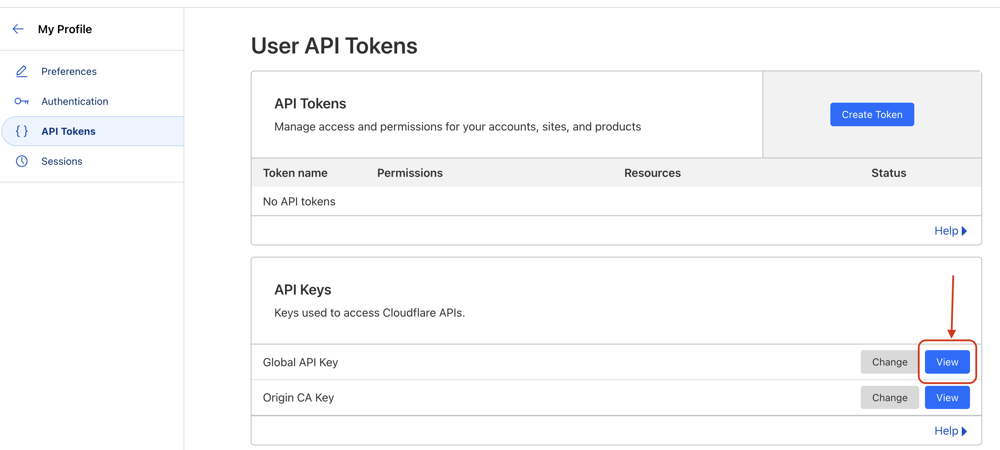

# Cloudflare Cache Clearing Script

A Python script to clear the cache for specified URLs (files) on Cloudflare with Global API key.

## Prerequisites

Before using the script, make sure you have the following:

- Python 3.x installed
- Required Python packages installed (install them using `pip install -r requirements.txt`)
   - requests
   - argparse
- get api_key:
  - 

## Usage

1. Clone the repository or download the script.
2. Install the required dependencies by running:
    ```bash
    pip install -r requirements.txt
    ```

3. Run the script using the following command:

    ```bash
    python script_name.py --email YOUR_CLOUDFLARE_EMAIL --api_key YOUR_CLOUDFLARE_API_KEY --urls URL1 URL2 URL3
    ```

   Replace `YOUR_CLOUDFLARE_EMAIL` and `YOUR_CLOUDFLARE_API_KEY` with your Cloudflare account email and API key, respectively. Replace `URL1`, `URL2`, `URL3`, etc., with the URLs (files) for which you want to clear the cache.

4. Follow the prompts to confirm cache clearance for each URL.

## Script Details

- `get_zone_id`: Function to retrieve the Cloudflare Zone ID for a given domain.
- `purge_cache`: Function to clear the cache for specified URLs in a Cloudflare Zone.
- `main`: The main function that parses command line arguments and iterates through the provided URLs.

